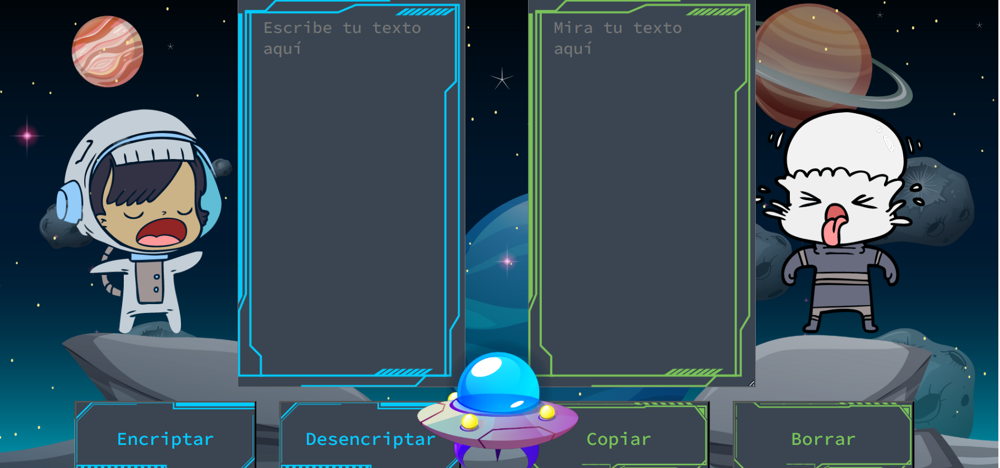

# Challenge-Encriptador-ONE-G5

Este es un proyecto que forma parte del programa ONE. El objetivo es crear un sitio web que sirva tanto para encriptar mensajes como para desencriptarlos, usando las habilidades aprendidas en HTML5, CSS3 y JavaScript.

## Características

- El sitio web tiene una interfaz sencilla y amigable que permite al usuario introducir un mensaje para encriptarlo o desencriptarlo con el crifrado exigido para el proyecto.
- El sitio web usa el algoritmo de cifrado César para transformar los mensajes según la clave indicada.
- El sitio web muestra el resultado de la operación en una caja de texto al lado del mensaje original.
- El sitio web tiene un botón para copiar el resultado al portapapeles y otro para limpiar los campos de texto.
- El sitio web es responsive y se adapta a diferentes tamaños de pantalla.

## Tecnologías

- HTML5: para crear la estructura y el contenido del sitio web.
- CSS3: para dar estilo y diseño al sitio web.
- JavaScript: para agregar interactividad y lógica al sitio web, usando funciones y eventos.

# Vista Previa

## Escritorio

- 

- 

- 

- 

## Mobile

# Diccionarios

## Encriptador

| Llave | Cambio |
|------------|------------|
| e | enter |
| i | imes |
| a | ai |
| O | ober |
| u | ufat |

## Desencriptador

| Llave | Cambio |
|------------|------------|
| enter | e |
| imes | i |
| ai | a |
| Ober | o |
| ufat | u |
## Instalación

Para usar este proyecto, puedes usar el siguiente enlace a GitHub Pages https://bit.ly/426oVF5, o clonar este repositorio, o descargarlo como un archivo ZIP. Luego, abre el archivo index.html en tu navegador preferido y empieza a encriptar o desencriptar mensajes.

## Licencia

Este proyecto está bajo la licencia MIT. Consulta el archivo LICENSE.md para más detalles.